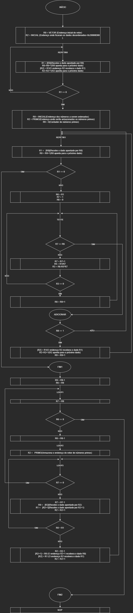
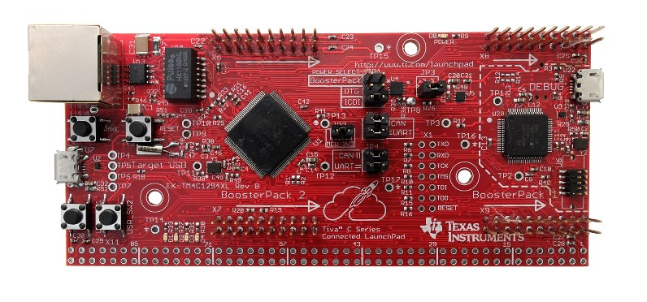

# armcod001

<!DOCTYPE html>
<html>
<head>
  <meta charset="UTF-8">
 
</head>
<body>
  <h3>Bubble sort em assembly arm </h3>
  

  <h3>Visão Geral do Projeto</h3>
  <ul>
    <li><strong>Nome do Projeto:</strong> Bubble sort em assembly arm</li>
    <li><strong>Nome da IDE:</strong> uVision da Keil</li>
    <li><strong>Nome da linguagem:</strong> assembly arm</li>
    <li><strong>Nome do Microcontrolador:</strong> TM4C1294</li>
    <li><strong>Nome da disciplina:</strong> Microcontroladores</li>
    <li><strong>Descrição:</strong>Implementação do algoritmo de ordenação bubble sort em assembly arm </li
  </ul>
  

  <h3>Componentes utilizados</h3>
    <ul>
      <li>  <h3>Fluxograma</h3>
        
      </li>
    

    <li>  
      <h3>Microcontrolador Utilizado</h3>
       
      </li>
    </ul>
 
  
</body>
</html>
